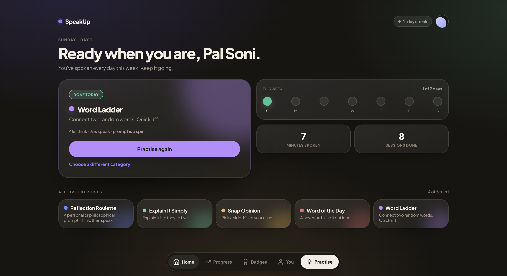
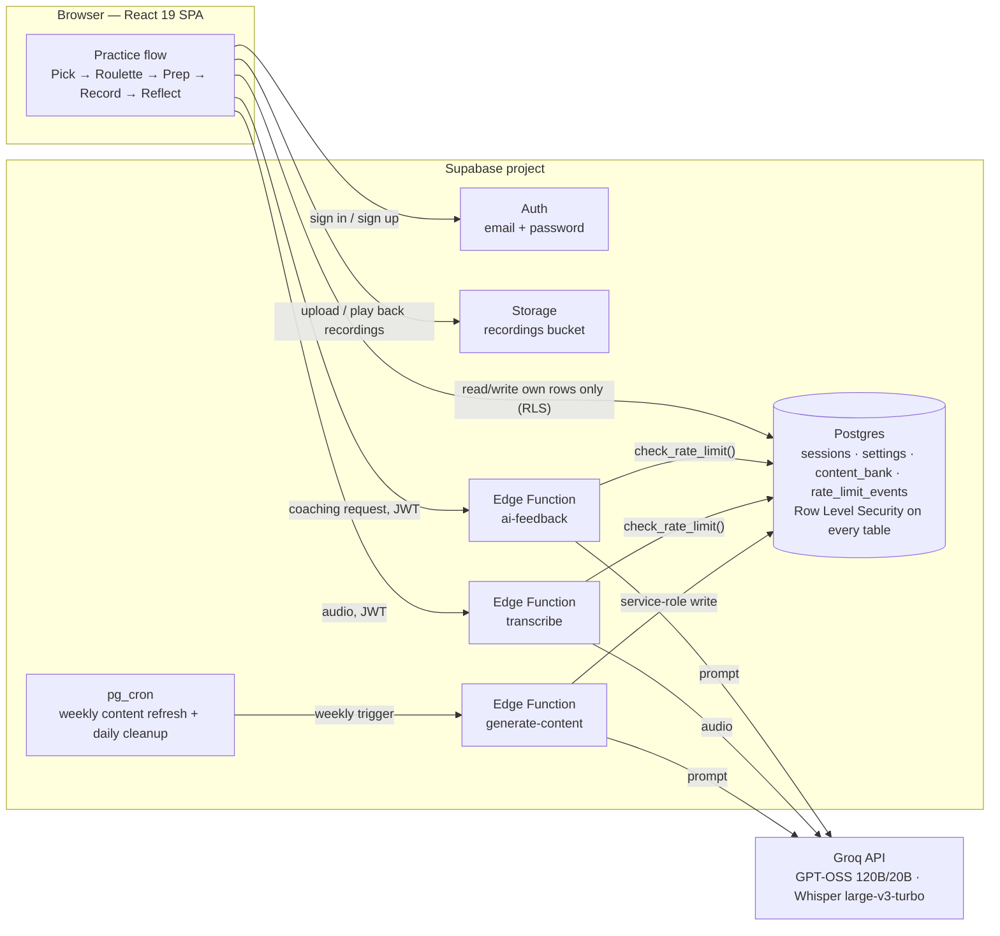

# SpeakUp

**Daily spoken-fluency practice in the browser.** Get a prompt, talk for 60–120 seconds, and see exactly how you sounded — pace, filler words, and pauses counted directly from your own transcript, plus a qualitative AI read on structure, delivery, and word choice.

[Live demo →](https://speakup-daily.vercel.app) &nbsp;·&nbsp; Built solo, end to end: product, frontend, database design, auth, AI integration, and infra.



<!-- A screenshot or short screen recording (GIF) of the practice flow itself
     — Home → Roulette → Record → Reflect — would be an even stronger addition
     here; the one above only shows the home screen. -->

---

## Contents

- [What it does](#what-it-does)
- [Architecture](#architecture)
- [Tech stack](#tech-stack)
- [Engineering notes](#engineering-notes)
- [Testing & code quality](#testing--code-quality)
- [Local development](#local-development)
- [Environment variables](#environment-variables)
- [Deployment](#deployment)
- [Project structure](#project-structure)
- [Roadmap](#roadmap)
- [License](#license)

## What it does

- **Five exercise types** — Reflection Roulette, Explain It Simply, Snap Opinion, Word of the Day, Word Ladder — each with its own prep/speak timers and a growing content bank.
- **Practice flow** — prep countdown → timed recording (browser `MediaRecorder`) → automatic transcription → playback → self-rating + optional note.
- **Feedback, honestly labeled two ways**: numbers *counted* from your transcript (words/minute, filler-word rate, long pauses, power/weak-word hits) sit next to a model's *qualitative read* (structure balance, strongest line, what to tighten, a delivery and word-choice score) — the UI never blurs the two into one mystery number.
- **Real accounts** — email/password via Supabase Auth. Sessions, streak, badges, and settings follow the account across devices.
- **History & progress** — every session kept with its recording, transcript, and feedback; trend charts once you have a few sessions in.
- **11 badges**, a daily streak, and a 7-day activity strip to make the habit visible.

## Architecture

A static React SPA talking directly to Supabase (Postgres + Auth + Storage + Edge Functions) — no backend server of my own to operate. The two AI-dependent features (coaching feedback, transcription) are proxied through Edge Functions specifically so the third-party API key never reaches the browser and every request can be rate-limited per account server-side.



**Auth & data isolation.** Every table (`sessions`, `settings`, `rate_limit_events`) has Row Level Security scoped to `auth.uid()` — a user can only ever read or write their own rows, enforced by Postgres itself, not app code. `content_bank` (the shared prompt/topic library) is read-only for signed-in users and only writable via the service-role key, so no client request can ever mutate it.

**AI proxy pattern.** `src/lib/aiCoach.js` and `src/lib/whisper.js` never call Groq directly — they call Supabase Edge Functions (`ai-feedback`, `transcribe`), which hold `GROQ_API_KEY` as a server-side secret and are the only thing that ever talks to Groq. Both are deployed with `verify_jwt: true`, so an unauthenticated request can't reach them at all.

**Local-first transcription, hosted fallback.** `src/lib/whisper.js` tries a local `faster-whisper` server first (`whisper-server/`, zero network hop, nothing leaves the machine) and falls back to the hosted `transcribe` Edge Function — Groq's hosted Whisper — when it isn't running. Local dev gets fast, free, fully offline transcription; every other visitor gets the same feature with zero setup.

## Tech stack

| Layer | Choice |
|---|---|
| Frontend | React 19, Vite 8, plain CSS (no component library) — no router; screen transitions are plain React state |
| Backend | Supabase — Postgres, Auth, Storage, Edge Functions (Deno) |
| AI inference | Groq (free-tier, open-weight models: GPT-OSS 120B/20B for coaching, Whisper large-v3-turbo for transcription) |
| Error monitoring | Sentry (optional, opt-in via env var) |
| Testing | Vitest + jsdom, 67 unit tests over the pure-logic modules (`analysis.js`, `badges.js`, `exerciseEvaluation.js`, `content.js`, `storage.js`) |
| Linting | oxlint |
| Local dev transcription | Python + Flask + `faster-whisper` (optional) |

## Engineering notes

A few decisions worth calling out on their own, since they're the parts that don't show up just from reading feature names:

- **Rate limiting designed to survive a hostile client, not just a well-behaved one.** `check_rate_limit()` (`supabase/schema.sql`) is a `SECURITY DEFINER` Postgres function reading `auth.uid()` server-side — a client can't spoof another user's quota or forge its own usage history, because it never gets direct read/write access to the `rate_limit_events` table at all (RLS is on with zero policies granted; the function is the only door in). Each Edge Function forwards the caller's own JWT into a fresh Supabase client before checking, rather than trusting anything in the request body.
- **Fails open on infrastructure, fails closed on abuse.** If the rate-limit check itself errors (e.g. a transient DB hiccup), both Edge Functions log it and let the request through — a broken cost-control shouldn't take down the feature it's protecting. An actual over-limit result, by contrast, blocks the request with a specific, honest message (`"You've reached today's limit — resets at midnight UTC"`), not a generic failure.
- **Prompt injection is treated as a cost/abuse question, not just a content-safety one.** User transcripts are interpolated directly into the coaching prompts (`src/lib/aiCoach.js`) — there's no getting around that for a "read what I said and coach me" feature. Since the model's output is only ever shown back to the same signed-in user (no cross-user or downstream execution surface), the real risk isn't XSS or privilege escalation, it's someone using the feature to draw free-tier inference for something unrelated to speaking practice. Prompt/audio size caps and the per-user rate limits above bound that blast radius.
- **Every background failure shows a real, specific message.** Early versions of the data-loading code (`getSessions()`, `getSettings()`, etc.) had `.then()` chains with no `.catch` — a failed fetch silently left screens on stale or zeroed data with no indication anything was wrong. Every one of those paths now surfaces the actual error with a retry action, and reports through `src/lib/errorMonitoring.js` (Sentry, when configured) so a production issue doesn't rely on a user filing a bug report to be discovered.
- **The model's judgment is visually separated from ground truth.** The UI consistently distinguishes *measured* (counted from the transcript by deterministic code) from *AI read* (a model's holistic judgment) — see `Reflect.jsx`'s tab panels and the landing page's "Measured" vs. "AI read" labels. This was a deliberate product/trust decision: a made-up "94% confidence" score reads as more authoritative than it is; showing the receipts next to the model's opinion doesn't.
- **RLS as the actual security boundary, not app-layer checks.** There is no `if (session.userId !== currentUser.id)` guard anywhere in the client — because there doesn't need to be. Every query goes through Supabase's client SDK, and Postgres itself refuses to return or accept rows that don't belong to the caller. The one deliberate exception (`content_bank`) is read-only for every signed-in user by design, since it's shared reference data, not personal data.

## Testing & code quality

```
npm test        # vitest run — 67 tests over the pure-logic modules
npm run lint     # oxlint
npm run build    # production build sanity check
```

Testing is concentrated on the modules that are pure functions with real logic worth pinning down — pace/filler/articulation scoring, badge-earning thresholds, streak math across timezones and month boundaries, exercise-fit evaluation. UI components and the Supabase-dependent `lib/` modules aren't unit-tested directly; they're kept thin and manually verified, which is a deliberate scope call for a solo project, not an oversight.

## Local development

```bash
git clone <this-repo>
cd speakup-web
npm install
npm run dev
```

Needs a Supabase project and a Groq API key to run for real — see below. Without a configured `.env`, the app shows a setup screen instead of crashing.

### 1. Supabase

1. Create a free project at [supabase.com](https://supabase.com).
2. **SQL Editor → New query** → paste all of `supabase/schema.sql` → **Run**. Idempotent — safe to re-run any time the file changes. Creates `sessions`/`settings`/`content_bank`/`rate_limit_events`, RLS policies, the `recordings` storage bucket, and two `pg_cron` jobs (weekly content refresh, daily rate-limit cleanup).
3. **Project Settings → API** → copy the Project URL and `anon` `public` key into `.env` (copy `.env.example` first).
4. **Authentication → Providers → Email**: leave "Confirm email" **on** for anything beyond local testing.
5. **Authentication → URL Configuration → Redirect URLs**: add every origin you run this from (`http://localhost:5173`, plus your deployed domain).
6. **Authentication → Policies → Password**: enable "Leaked password protection" (free, checks against HaveIBeenPwned).

### 2. Groq (powers AI coaching + transcription)

1. Free API key at [console.groq.com/keys](https://console.groq.com/keys).
2. Deploy `supabase/functions/ai-feedback` and `supabase/functions/transcribe` (`supabase functions deploy <name>`, or paste each `index.ts` into the dashboard's Edge Functions editor).
3. `supabase secrets set GROQ_API_KEY=your-key-here` — server-side only, never a frontend env var.

Both functions require a valid Supabase session and independently rate-limit each account (see [Engineering notes](#engineering-notes)) — free-tier Groq limits are shared org-wide across every user, so this is what stops one account from starving everyone else.

### 3. Error monitoring (optional)

Free [Sentry](https://sentry.io) project → copy the DSN → set `VITE_SENTRY_DSN`. Unset by default; the app works identically either way.

### 4. Local Whisper (optional)

`whisper-server/` runs transcription fully offline for local dev — see its own README. Not required; `src/lib/whisper.js` falls back to the hosted Edge Function automatically if it isn't running.

## Environment variables

| Variable | Where | Required | Notes |
|---|---|---|---|
| `VITE_SUPABASE_URL` | `.env` + host | Yes | Project Settings → API |
| `VITE_SUPABASE_ANON_KEY` | `.env` + host | Yes | Safe to ship client-side — protected by RLS, not secrecy |
| `VITE_SENTRY_DSN` | `.env` + host | No | Enables error monitoring |
| `GROQ_API_KEY` | Supabase secret only | Yes | `supabase secrets set` — never a frontend variable |
| `GROQ_FALLBACK_MODEL` | Supabase secret only | No | Defaults to `openai/gpt-oss-20b` |

## Deployment

```bash
npm run build     # outputs dist/ — static, deployable anywhere
npm run preview   # sanity-check the production build locally
```

`vercel.json` and `netlify.toml` are both included (pick whichever host you use). Set the environment variables above on the host; `.env` itself is git-ignored and never deployed.

| Host | Rollback |
|---|---|
| Vercel | **Deployments** → previous good build → **⋯ → Promote to Production** |
| Netlify | **Deploys** → previous good deploy → **Publish deploy** |
| Cloudflare Pages | **Deployments** → **⋯ → Rollback to this deployment** |

All three keep free deploy history with one-click rollback — no extra setup beyond connecting the repo. The Supabase side doesn't roll back the same way: `schema.sql` is safe to re-run, but there's no down-migration if a change needs undoing.

## Project structure

```
src/
  App.jsx                  auth-gated routing — Supabase session state + plain React state, no router lib
  main.jsx                 entry point, optional Sentry init + crash boundary
  screens/                 Home, Progress, Badges, Settings, Login, ResetPassword, Landing,
                            Pick, Roulette, Prep, Record, Reflect, Celebrate
  components/
    UI.jsx                 shared Card/Button/Pill/Switch/Tabs/LoadErrorNote primitives
    CrashFallback.jsx       fallback UI for the top-level error boundary
  lib/
    content.js              exercise types + prompt/topic/vocab banks + daily assignment
    supabaseClient.js        Supabase client + "is it configured" check
    auth.js                  sign up / sign in / sign out / password reset
    storage.js               sessions/settings/recordings + streak & stat calculations
    badges.js                badge definitions + earning logic
    analysis.js               rule-based feedback: pace, fillers, power/weak words, articulation score
    exerciseEvaluation.js      per-exercise-type deterministic evaluation (word usage, argument structure, ...)
    aiCoach.js                 AI coaching client — talks to the ai-feedback Edge Function
    whisper.js                 transcription client — local server first, hosted Edge Function fallback
    recorder.js                MediaRecorder wrapper hook + silence/pause detection
    speech.js                  browser SpeechRecognition wrapper (live captions)
    errorMonitoring.js         optional Sentry wiring
  index.css                  theme + all styling (no CSS framework)
supabase/
  schema.sql                 tables, RLS policies, rate limiter, storage bucket, cron jobs
  functions/
    ai-feedback/              proxies coaching prompts to Groq (holds GROQ_API_KEY)
    transcribe/                proxies audio to Groq's hosted Whisper
    generate-content/          scheduled batch job that grows content_bank via Groq
whisper-server/               optional local Whisper server (Python + faster-whisper) for local dev
public/
  terms.html, privacy.html     placeholder legal pages — see the banner on each before relying on them
```

## Roadmap

- Daily reminders (a preference-only toggle existed and was removed rather than left as dead UI — needs real Web Push: service worker + per-user subscriptions + a Supabase Cron scheduler).
- Private recordings via signed URLs instead of a public-but-unlisted bucket.
- Real legal review of `public/terms.html` / `public/privacy.html` (currently clearly-marked placeholders).

## License

[MIT](./LICENSE) — see the `LICENSE` file.

---

Built by Pal Soni as a solo project — architecture, frontend, database design, auth, AI integration, and deployment all one person's work end to end.
